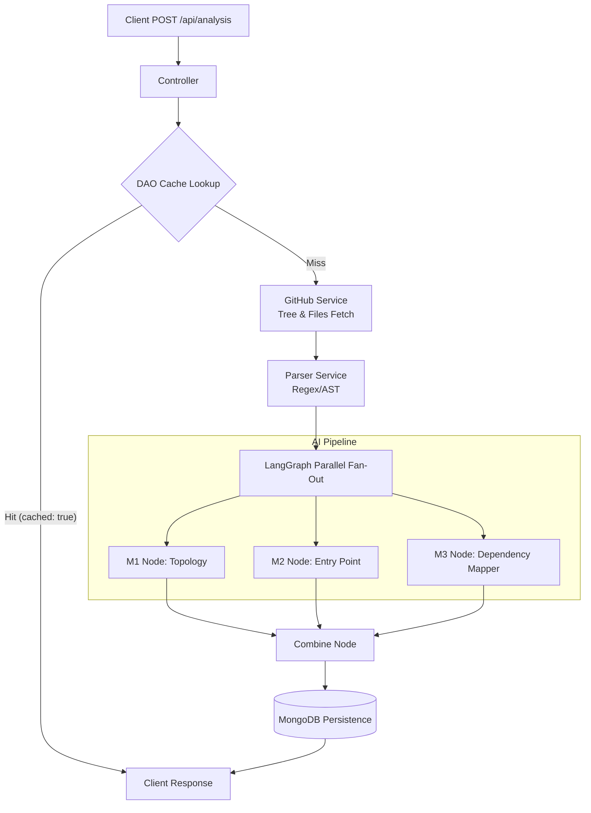

# 🚀 Antigravity IDE - Backend Analysis Engine

[](https://nodejs.org/)
[](https://expressjs.com/)
[](https://www.typescriptlang.org/)
[](https://www.mongodb.com/)
[](https://python.langchain.com/v0.1/docs/langgraph/)
[](https://deepmind.google/technologies/gemini/)

> **AI-Powered Codebase Onboarding & Repository Analysis Engine.**

Antigravity IDE is a high-performance backend platform that ingests public GitHub repositories and generates instant architectural insights using static parsing and a parallel LangGraph AI pipeline powered by Google Gemini (via `@langchain/google-genai`).

---

## ✨ Core Features & Modules

### 📂 M1: Directory Topology
Categorizes top and mid-level folders within the repository and explains their engineering purpose in plain English, paired with intuitive UI badges.

### ⚡ M2: Entry Point & Execution Trace
Detects the true entry point of the application (e.g., `server.ts`, `index.js`, `main.py`). It fetches relevant code snippets and traces the chronological boot sequence step-by-step to provide a clear understanding of how the application starts.

### 🗺️ M3: Module Dependency Mapper
Maps internal file import relationships, reverse imports (`importedBy`), and generates comprehensive ASCII execution flow diagrams to visualize the architecture.

### 💨 SHA-256 Cache Engine
Hashes GitHub URLs (`repoUrlHash`) to deliver sub-50ms instant responses for previously analyzed repositories, ensuring lightning-fast performance and minimizing redundant AI processing.

### 🔄 Asynchronous Lifecycle DAO
Manages analysis states (`waiting` ➔ `active` ➔ `completed` / `failed`) for robust fault tolerance, seamless background processing, and accurate status tracking.

---

## 🏗️ Architecture & Execution Flow

The analysis pipeline leverages LangGraph for parallel execution, ensuring speed and resilience.



---

## 🛠️ Tech Stack

| Category | Technology |
| :--- | :--- |
| **Language** | TypeScript |
| **Runtime** | Node.js (ES Modules) |
| **Framework** | Express.js |
| **AI Framework** | LangGraph (`@langchain/langgraph`), `@langchain/google-genai` |
| **Database** | MongoDB & Mongoose (with DAO pattern) |
| **Validation** | Zod |

---

## 📁 Directory Structure

```ascii
backend/
├── src/
│   ├── ai/                # LangGraph nodes, edges, and state management
│   ├── controllers/       # Express route handlers
│   ├── dao/               # Data Access Objects for MongoDB (Lifecycle & Cache)
│   ├── models/            # Mongoose schemas
│   ├── routes/            # API route definitions
│   ├── services/          # Business logic (GitHub, Parser)
│   ├── utils/             # Helpers (Hashing, formatting)
│   ├── index.ts           # Application entry point
│   └── app.ts             # Express app setup
├── package.json
├── tsconfig.json
└── .env.example
```

---

## ⚙️ Environment Variables

Create a `.env` file in the root of the project with the following variables:

```env
# Server Configuration
PORT=3000
NODE_ENV=development

# Database
MONGO_URI=mongodb+srv://<username>:<password>@cluster0.mongodb.net/antigravity?retryWrites=true&w=majority

# AI / LLM
GOOGLE_API_KEY=your_gemini_api_key_here

# GitHub (Optional, to avoid rate limits)
GITHUB_TOKEN=your_github_personal_access_token
```

---

## 🚀 Installation & Getting Started

1. **Clone the repository:**
   ```bash
   git clone https://github.com/your-org/antigravity-ide-backend.git
   cd antigravity-ide-backend
   ```

2. **Install dependencies:**
   ```bash
   npm install
   ```

3. **Configure Environment Variables:**
   Copy `.env.example` to `.env` and fill in your credentials.
   ```bash
   cp .env.example .env
   ```

4. **Run the development server:**
   ```bash
   npm run dev
   ```

---

## 📚 API Documentation

### Analyze Repository

**`POST /api/analysis`**

Initiates the analysis of a public GitHub repository.

**Request Headers:**
- `Content-Type: application/json`

**Request Body:**
```json
{
  "githubUrl": "https://github.com/expressjs/express"
}
```

**Response Schema (Fresh Analysis - 200 OK):**
```json
{
  "success": true,
  "cached": false,
  "data": {
    "repoUrlHash": "a1b2c3d4...",
    "status": "completed",
    "m1_topology": { ... },
    "m2_entry_point": { ... },
    "m3_dependencies": { ... }
  }
}
```

**Response Schema (Cache Hit - 200 OK):**
```json
{
  "success": true,
  "cached": true,
  "data": {
    "repoUrlHash": "a1b2c3d4...",
    "status": "completed",
    "m1_topology": { ... },
    "m2_entry_point": { ... },
    "m3_dependencies": { ... }
  }
}
```

**Validation Error Schema (400 Bad Request):**
```json
{
  "success": false,
  "error": "Invalid GitHub URL",
  "details": [ ...Zod errors... ]
}
```

---

## 🧪 Testing & Usage

### cURL Example

```bash
curl -X POST http://localhost:3000/api/analysis \
  -H "Content-Type: application/json" \
  -d '{"githubUrl": "https://github.com/expressjs/express"}'
```

### Postman Setup
1. Create a new `POST` request to `http://localhost:3000/api/analysis`.
2. Set the body type to `raw` and `JSON`.
3. Paste the request body JSON above and click Send.

---

## 🛡️ Error Handling & Resilience

The Antigravity IDE Backend is designed with fault tolerance in mind:

- **Parallel Node Isolation:** The LangGraph AI pipeline executes M1, M2, and M3 nodes in parallel. If one node (e.g., M2) fails due to LLM hallucinations or parsing errors, the other nodes (M1 and M3) will still complete successfully, ensuring partial data is always returned rather than failing the entire request.
- **Robust Validation:** All incoming requests are strictly validated against predefined schemas using **Zod**, preventing malformed data from entering the pipeline.
- **Non-Fatal Fallbacks:** Mechanisms are in place to handle API rate limits, large repository timeouts, and fallback strategies are employed to degrade gracefully.
- **State Management:** The Lifecycle DAO ensures that if the server crashes during an `active` analysis, the state can be recovered or safely marked as `failed`.
