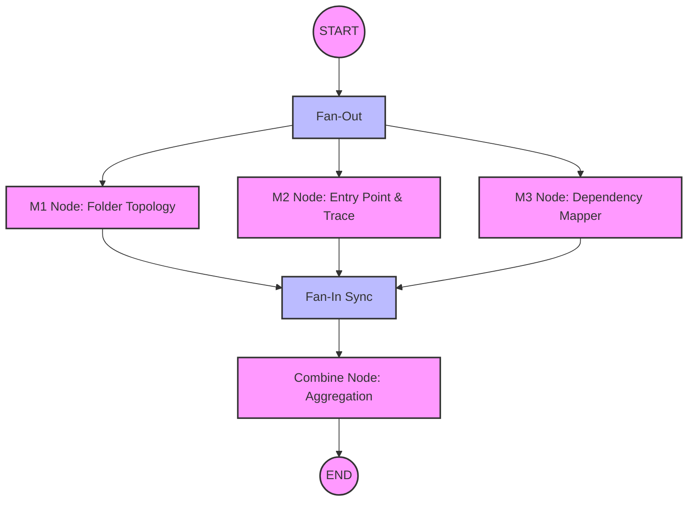

# CodeAstra AI Pipeline Documentation

> A deep-dive into the AI Analysis Layer powering the Antigravity IDE / CodeAstra repository analyzer.

This document details the exact design, orchestration, parallel execution model, prompt engineering strategy, and state management utilized in our LangGraph-powered AI Pipeline.

---

## 1. AI Pipeline Overview & Design Philosophy

The AI Pipeline in CodeAstra is engineered to quickly and accurately analyze complex GitHub repositories. Rather than relying on a monolithic prompt call which can suffer from context window saturation, degraded reasoning, and single points of failure, we adopted a decentralized, graph-based architecture using **LangGraph** (`@langchain/langgraph`) paired with **Google Gemini** (`@langchain/google-genai`).

### Core Benefits

*   **Parallel Execution (Fan-out/Fan-in)**: By decoupling the analysis into independent tasks (Folder Topology, Entry Point Tracing, Dependency Mapping), nodes can execute concurrently. This drastically reduces the total turnaround time.
*   **Fault Isolation**: The failure of one analytical node does not cascade and bring down the entire pipeline. The system degrades gracefully.
*   **Strict Zod Schema Guarantee**: LLM hallucinations and malformed JSON are heavily mitigated by enforcing strict Zod schemas on the structured outputs from Gemini.
*   **Modular Scalability**: New analysis vectors (e.g., Security Scanning, API Endpoint Mapping) can be added as new nodes with zero disruption to the existing execution graph.

---

## 2. LangGraph State Management (`state.ts`)

State within our LangGraph is strongly typed and immutable. We leverage `Annotation.Root` to define the shape of the data flowing between nodes.

### The State Shape

```typescript
import { Annotation } from "@langchain/langgraph";
// Import respective node output types...

export const StateAnnotation = Annotation.Root({
  // Input Data
  parsedRepo: Annotation<IParsedRepo>(),
  entryContents: Annotation<string | null>(),

  // Node Outputs
  m1Result: Annotation<IM1Result | null>(),
  m2Result: Annotation<IM2Result | null>(),
  m3Result: Annotation<IM3Result | null>(),
  
  // Final Aggregation
  combined: Annotation<IAnalysisResult | null>(),
  
  // Non-destructive Error Accumulation
  errors: Annotation<string[]>({
    reducer: (prev, next) => [...prev, ...next],
    default: () => [],
  }),
});
```

### Non-Destructive Error Accumulation

The `errors` field utilizes a custom reducer: `(prev, next) => [...prev, ...next]`. This is critical for our fault isolation strategy. Instead of a node throwing an unhandled exception and crashing the graph, it catches its own error, logs it, and appends a structured error string to the `errors` array state. The graph continues executing uninterrupted.

---

## 3. Centralized Base LLM Setup (`model.ts`)

To adhere to DRY (Don't Repeat Yourself) principles and maintain consistency, the underlying language model is instantiated centrally.

```typescript
import { ChatGoogleGenerativeAI } from "@langchain/google-genai";

// Centralized Base LLM
export const baseLlm = new ChatGoogleGenerativeAI({
  modelName: "gemini-1.5-flash",
  temperature: 0, // Deterministic outputs for analysis
});
```

We utilize `gemini-1.5-flash` for its optimal balance of speed, cost, and reasoning capability. The `temperature` is explicitly set to `0` to enforce deterministic, analytical responses rather than creative generation.

In individual nodes, this base model is bound to specific schemas:

```typescript
// Example from a Node
const modelWithStructure = baseLlm.withStructuredOutput(M1Schema);
```

---

## 4. Detailed Node Analysis

The pipeline splits the workload across specialized nodes.

### M1 Folder Topology Node (`m1Folder.node.ts`)
*   **Role**: Analyzes the repository's directory hierarchy, maps the overarching purpose of specific folders, and assigns role categories (e.g., `logic`, `config`, `utility`, `test`, `entry`, `other`).
*   **Prompting Strategy**: Utilizes a highly structured System Prompt defining the exact constraints of each category. To conserve tokens, it filters the `parsedRepo` to only expose unique directory paths, hiding file-level noise.

### M2 Entry Point & Execution Trace Node (`m2EntryPoint.node.ts`)
*   **Role**: Identifies the true entry point of the application (e.g., `server.ts`, `index.js`, `main.go`) and constructs a step-by-step trace of the startup execution flow.
*   **Context Enrichment**: This node operates with high precision by requesting actual GitHub snippet context (`entryContents`) for the suspected entry files, allowing the LLM to read the exact bootstrap logic rather than guessing from filenames.

### M3 Dependency Mapper Node (`m3Dependency.node.ts`)
*   **Role**: Maps internal file import relationships, establishes reverse import chains (`importedBy`), and generates an ASCII tree diagram representing the module dependency graph.
*   **Token Safeguard**: Internal dependency chains can grow exponentially. To protect against token limits and timeout issues, this node caps its deep analysis to the top 40 most critical internal relative files (`.slice(0, 40)`).

### Combine Node (`combine.node.ts`)
*   **Role**: The final step in the graph. It aggregates the parallel outputs (`m1Result`, `m2Result`, `m3Result`) into the final `IAnalysisResult` interface.
*   **Resilience**: It actively checks for missing node outputs. If a node failed (e.g., M2 timed out), the Combine Node surfaces this as a non-fatal warning within the final `CombinedOutput`, stitching together whatever partial data was successfully generated.

---

## 5. Parallel Branching Architecture Diagram

The execution flow of the LangGraph StateGraph is visualized below. Note the parallel Fan-Out to M1, M2, and M3.



---

## 6. Structured Output Validation (Zod Schemas)

To guarantee that Gemini returns data matching our internal TypeScript interfaces, we employ Zod schemas heavily annotated with `.describe()`.

```typescript
import { z } from "zod";

export const M1Schema = z.object({
  folders: z.array(
    z.object({
      path: z.string().describe("The relative path of the directory, e.g., 'src/utils'"),
      purpose: z.string().describe("A concise 1-sentence description of the folder's responsibility"),
      category: z.enum(["logic", "config", "utility", "test", "entry", "other"]).describe("The designated role of this directory"),
    })
  ).describe("An array of analyzed directories in the repository."),
});
```

These `.describe()` annotations are crucial. They are passed directly into the Gemini prompt via LangChain's underlying function calling/structured output mechanics. They act as inline instructions guiding the model's generation process, significantly reducing JSON parsing crashes or schema mismatches.

---

## 7. Orchestration Layer (`ai.service.ts`)

The `ai.service.ts` acts as the conductor for the entire process, bridging the external API with the internal AI Graph.

**The Data Transformation Pipeline:**

1.  **GitHub URL**: The client requests analysis for a repository URL.
2.  **GitHub Service**: Clones or fetches the repository structure.
3.  **Parser Service (IR)**: Translates the raw file tree into our normalized Internal Representation (`IParsedRepo`).
4.  **Entry Snippet Resolution**: Heuristically identifies likely entry point files and fetches their raw content snippets to empower the M2 Node.
5.  **`runAnalysisGraph()`**: Instantiates the LangGraph, passes in the initial state (parsed IR + snippets), and invokes the execution.

---

## 8. Error Resilience & Degradation

The most significant architectural advantage of this pipeline is its resilience.

In a traditional monolithic prompt, if the LLM fails to reason about the entry point, the entire response might be malformed or fail generation.

In our LangGraph model:
*   If the **M2 Node** encounters an error (e.g., token limit exceeded while analyzing entry snippets), it catches its own error, appends it to the `errors` state array, and returns `null` for `m2Result`.
*   Meanwhile, **M1** and **M3** execute successfully and return their partial state.
*   The **Combine Node** detects the missing `m2Result`, logs a warning, but successfully constructs the final response using the data from M1 and M3.

The client receives a slightly degraded but still highly valuable analysis, rather than a HTTP 500 Server Error.
